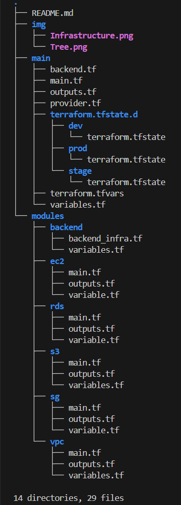

# AWS Architecture with Terraform

This project provisions a **secure and modular infrastructure on AWS** using **Terraform.** It includes a **network layer, compute layer (EC2), database layer (RDS), and S3 for storage and backend state management**, all defined and deployed through **Infrastructure as Code (IaC)**. The infrastructure supports private and public subnets, NAT Gateway for internet access in private networks, security groups for traffic control, and a robust backend configuration for safe and collaborative Terraform usage.

Provisionable in the infrastructure are:

1. Two **EC2 instances** in the Private subnet

2. Two **EC2 instances** in the Public subnet

3. An **RDS instance**

4. An **S3 bucket**

5. A full **network layer** including:
* **Internet Gateway** *linked through*
*  Two **Route tables** *routing traffic to the*
* Two **Private subnets** in two ***Availabilty Zones*** *and*
* One **Public subnet** *and*
* One **Elastic ip** *attached to*
* A **NAT Gateway**.
6. A fully configured **backend s3 bucket** *for remote state locking.*

# ☁️ Infrastructure Components
### VPC Module
* Public and private subnets across 3 AZs
* Internet Gateway & NAT Gateway
* Route Tables for public and private routing

### Security Group Module
* Allows ingress/egress rules
* Separate security groups for EC2 and RDS
* Blocks all public access unless explicitly allowed

### EC2 Module
* Launches **public** and **private** EC2 instances
* Connects instances to subnets and security groups
* Public instances have `associate_public_ip_address = true`

### RDS Module
* Creates a PostgreSQL or MySQL RDS instance
* Launches in **private subnet**
* Protected via RDS-specific security group
* Optional DB subnet group configuration

### S3 Module
* Backend bucket for remote Terraform state
* Additional general-purpose S3 bucket
* Public access blocked by:

    * `block_public_acls`

    * `block_public_policy`

    * `ignore_public_acls`

    * `restrict_public_buckets`

* Versioning enabled

# 🔐 Security Considerations
* All S3 buckets block public access.
* No hardcoded secrets — use `terraform.tfvars` or environment variables.
* RDS launched in private subnets.
* IAM credentials and access keys are never stored in code.

# Evironment Workspaces

I added the Dev, Stage and Prod environments using `terraform workspace new <env>`, then I switched workspaces with `terraform workspace select <env>`.
I can also write the tfvars files for each env e.g dev.tfvars, etc. Then apply using `terraform apply -var-file=dev.tfvars`, for example.

*Fig 2. File structure tree* 